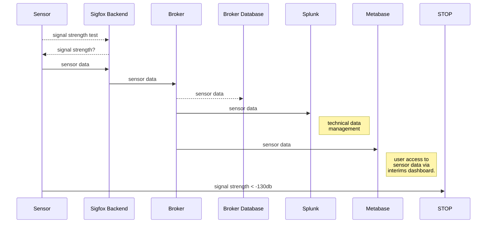
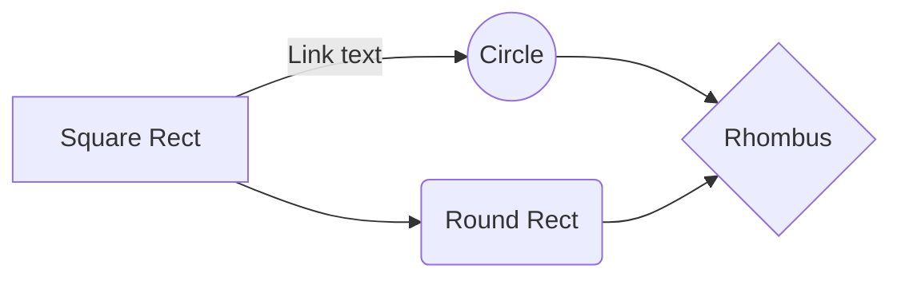

# SaveYourFridge!
SaveYourFridge
## Installation
### Pre notices
> Edit/view this README.md in StackEdit: https://stackedit.io/app#
### Sigfox activation
### Sigfox backend
https://backend.sigfox.com/
### Firmware
https://pycom.io/downloads/#firmware
### Editor
https://code.visualstudio.com/download
https://marketplace.visualstudio.com/items?itemName=pycom.Pymakr
> Inoperability VScode with Pymakr Plugin: Please install VSCode 1.30.x with Pymakr 1.05 plugin - this combination works great. The following links give a good instruction, what do do, to downgrade to these versions
> https://code.visualstudio.com/updates/v1_30
> https://forum.pycom.io/topic/3808/i-have-a-problem-with-vscode-and-the-pymakr-plugin
> https://github.com/Microsoft/vscode/issues/68230
### Code
## Operation
###Python variable definition
| Variable | Values | Default | Definition |
|--|--|--|--|
| measurement_interval | # | 30 | seconds a measurement will be done (30=>5 minutes) |
| transmission_interval | # | 3600 | seconds a message will be sent (independently of alarm) (3600=>15 minutes) |
| anomaly_detection_difference | # | 2 | difference in degrees(celsius) to send alarm by device |
| low_power_consumption_mode | 0,1 | 0 | send device to deep sleep mode (1) Attention: system is not connectable anymore |
| send_all_data | 0,1 | 0 | send every measurement (1)
| fast_boot | 0,1 | 0 | no operational feedback at boot - ATTENTION: "0" is the only way to re-deploy code to the board without flashing the firmware! |
| no_singnal_test | 0,1 | 1 | no signal strength test at boot (1) |
| protocol_version | # | 1 | 1-254 | change, if data format changed |
### LED codes
| LED code | Duration | Definition |
|--|--|--|--|
| blue, orange | # | power saving mode indicator (blue=high power consumption, orange=low power consumption (energy saver)) |
| blue, orange | 1 sec. | measurement phase |
| green | 1 sec. | transmitting valid sensor data |
| red | 1 sec. | transmitting alarm (invalid) sensor data |
> Note: If signal strength test fails please replace the sensor an re-plug batteries to device. The strength test will be executed. If replacement will not help to get a better signal strength, please do not operate this device in a productive environment (as it will not get a stable connection).
### Boot procedere
| LED indicator at boot | description |
|--|--|
| 5 x *-, 1x *---, 5 x *- | The first 5x LED indicated starting the signal test, the long LED signal is the phase waiting for an result and the löast 5x blinking indicates a average/good signal strength|
| 5 x *-, 1x *---, ~ x *- | The first 5x LED indicated starting the signal test, the long LED signal is the phase waiting for an result and the last 5x blinking indicates a poor signal strength. Please power off the device, replace the device to an other location. Please power on the device to test the signal strength again. If the signal strength is still poor, retry the test several times - the network may be slow or anreachable temporary. If the signal quality keep poor, please do not operate the device.
### Sensor data transmission
#### Signal strength
|RSSI|Number of basestation|Link Quality indicator|
|--|--|--|
|-122dBm < RSSI|3|EXCELLENT|
|-135dBm < RSSI ≤ -122dBm|3|GOOD|
|-122dBm < RSSI|1 or 2|GOOD|
|-135dBm < RSSI ≤ -122dBm|1 or 2|AVERAGE|
|RSSI ≤ -135dBm|any|LIMIT|
Source: https://support.sigfox.com/docs/link-quality:-general-knowledge
#### Sensor data
Data transmission include the following data
| Data | Description |
|--|--|
| AABB | AA = protocal version (01) BB = compressed sensor data in hex |
#### Sensor data compression
Sensor data (here: temperature) will be compressed, so the sensor data includes decimal values and take into account to a value range 0 to 60 degrees.
compression:
`temp_compressed = int(original_temperature*2+80)`
decompression:
`temp_dedecompressed = ((int(temp_hex[2:],16)-80)/2)`
#### LED indicator phases
1. Check power mode => blue=high, orange, low
2. Power mode indictor (LED on 3x flashing)
3. Signal test (LED on)
4. Signal test result (Power on 3x = ok, LED flashing = nok)
#### Data transmission

### Program flow

###Sifgox backend
### Visualization
### Metabase
https://metabase.com/start/
### Splunk
___
Device type->PYCOM_Devkit_1->Edit->Custom configuration
battery::float:32:little-endian temp::float:32:little-endian
###Output in Sigfox backend
Device->Device id->Messages->Message with "battery" and "temp" printed
Hint: Battery as default data should be put in front of all other data. With the battery voltage we can control an escalation process to warn the user from backend side at a later point of time.