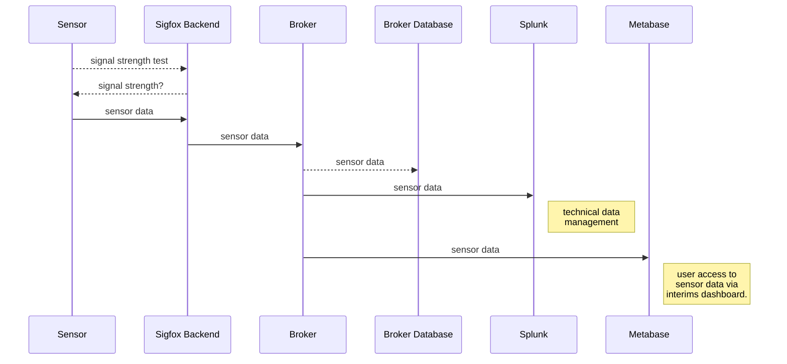
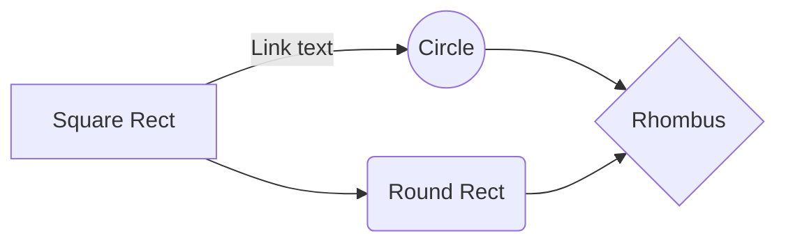

# SaveYourFridge!

SaveYourFridge

## Installation

### Sigfox activation

### Sigfox backend
https://backend.sigfox.com/
w

### Firmware
https://pycom.io/downloads/#firmware

### Editor

https://code.visualstudio.com/download

https://marketplace.visualstudio.com/items?itemName=pycom.Pymakr

> Inoperability VScode with Pymakr Plugin: Please install VSCode 1.30.x with Pymakr 1.05 plugin - this combination works great. The following links give a good instruction, what do do, to downgrade to these versions
> https://code.visualstudio.com/updates/v1_30
> https://forum.pycom.io/topic/3808/i-have-a-problem-with-vscode-and-the-pymakr-plugin
> https://github.com/Microsoft/vscode/issues/68230 

### Code

## Operation

###Python variable definition
| Variable | Values | Default | Definition |
|--|--|--|--|
| measurement_interval | # | 30 | seconds a measurement will be done (30=>5 minutes) |
| transmission_interval | # | 3600 | seconds a message will be sent (independently of alarm) (3600=>15 minutes) |
| anomaly_detection_difference | # |  2  differences in degrees(celsius) to send alarm by device |
| low_power_consumption_mode | 0,1 |  0 | send device to deep sleep mode (1) Attention: system is not connectable anymore |
| send_all_data | 0,1 |  0 | send every measurement (1)
| fast_boot |  0,1 | 0 | no operational feedback at boot - ATTENTION: "0" is the only way to re-deploy code to the board without flashing the firmware! |
| no_singnal_test { 0,1 | 1 | no signal strength test at boot (1) |
| protocol_version | # | 1 | 1-254 | change, if data format changed |

###Sensor data transmission

### Program flow

###Sifgox backend

### Visualization

### Metabase

### Splunk

___

Device type->PYCOM_Devkit_1->Edit->Custom configuration

  

battery::float:32:little-endian temp::float:32:little-endian

  

###Output in Sigfox backend

Device->Device id->Messages->Message with "battery" and "temp" printed

  

Hint: Battery as default data should be put in front of all other data. With the battery voltage we can control an escalation process to warn the user from backend side at a later point of time.

